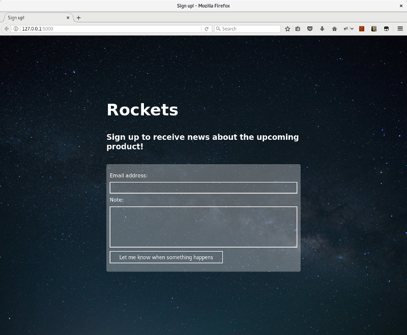

# Rockets

**Rockets** is a simple product launch page for collecting email addresses. Rockets store all data in SQLite database, making it easy to deploy and manage.



Rockets is built using:
* [Flask](http://flask.pocoo.org/)
* [SQLite](https://sqlite.org/)
* and [Python 3](https://www.python.org/)

## Installation

```
# inside the folder
pip install -r requirements.txt

export FLASK_APP=app.py
mkdir instance
flask initdb
```

## Run for development

```
# inside the folder
export FLASK_APP=app.py
export FLASK_DEBUG=1
flask run
```

## Run for production

Run using WSGI server such as [gunicorn](http://gunicorn.org):


```
# inside the folder
gunicorn app:app&
```

and setup a reverse proxy for port 8000, e.g. using Nginx.

## Run tests

```
python tests.py
```

## Customize

Just edit the template in `./templates/index.html`.
